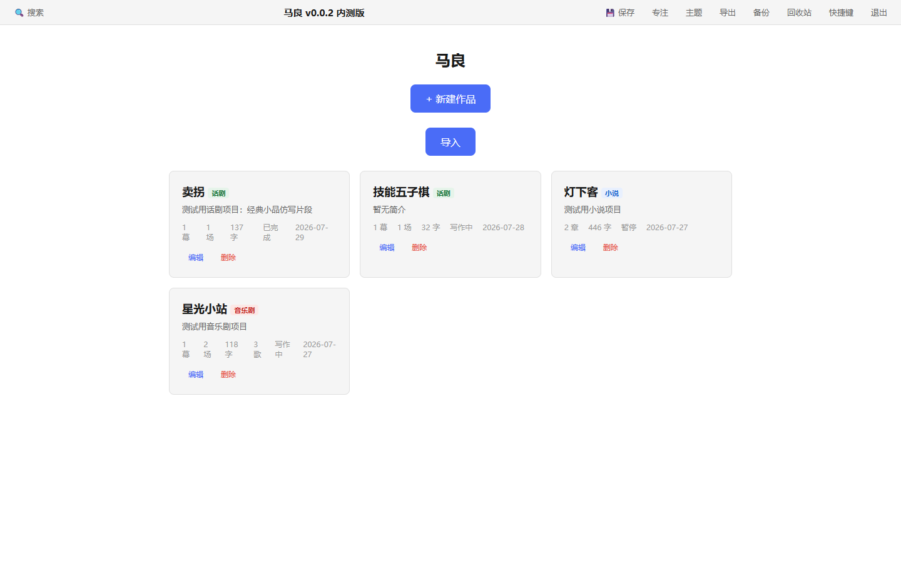
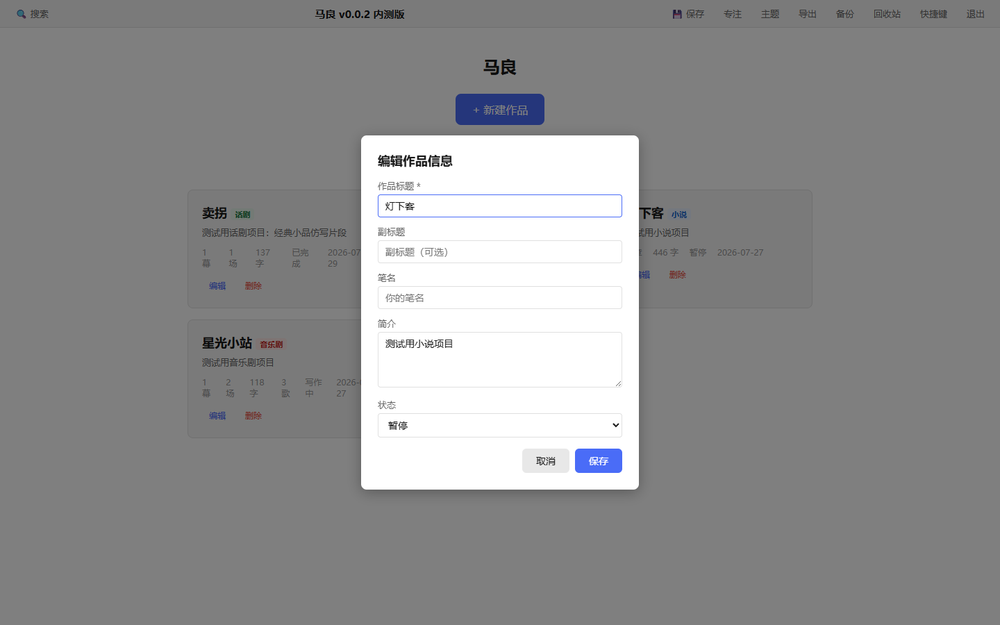
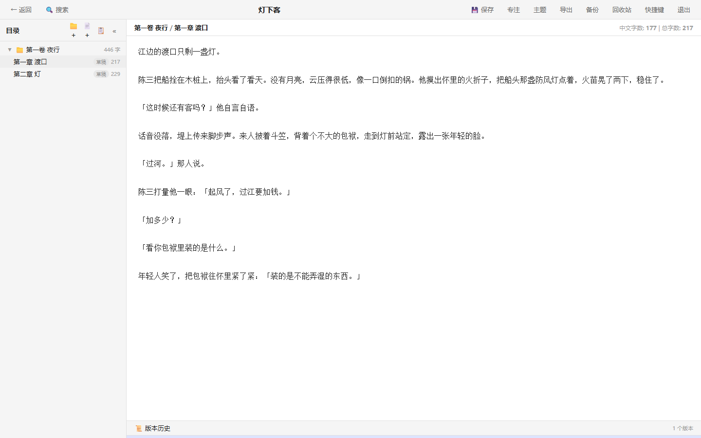
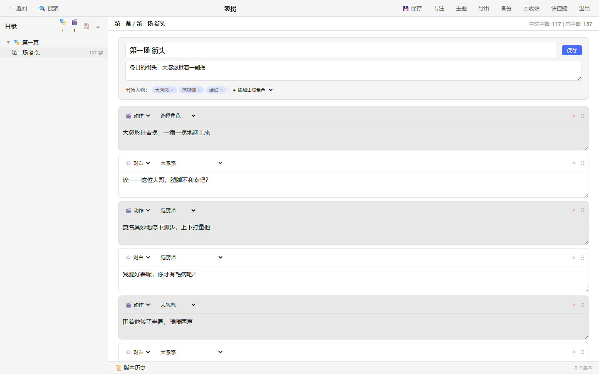
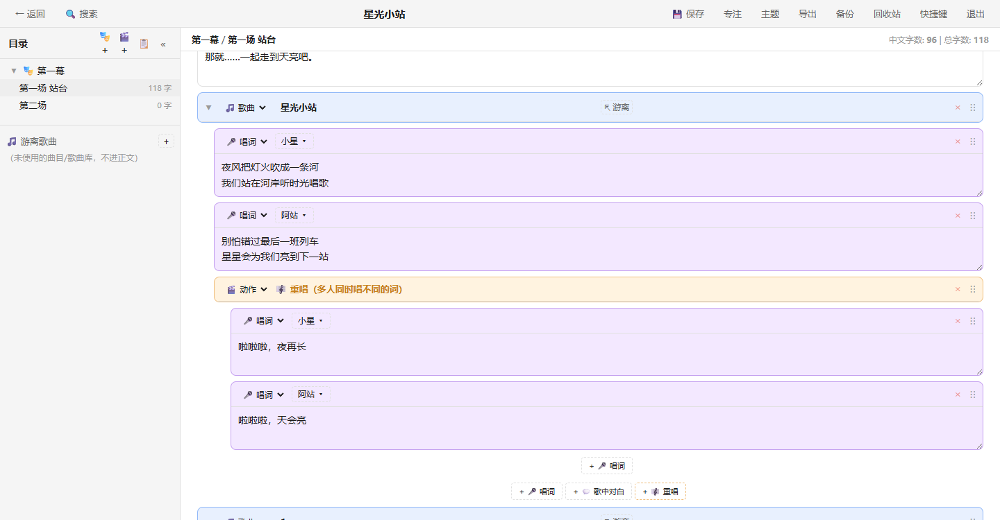
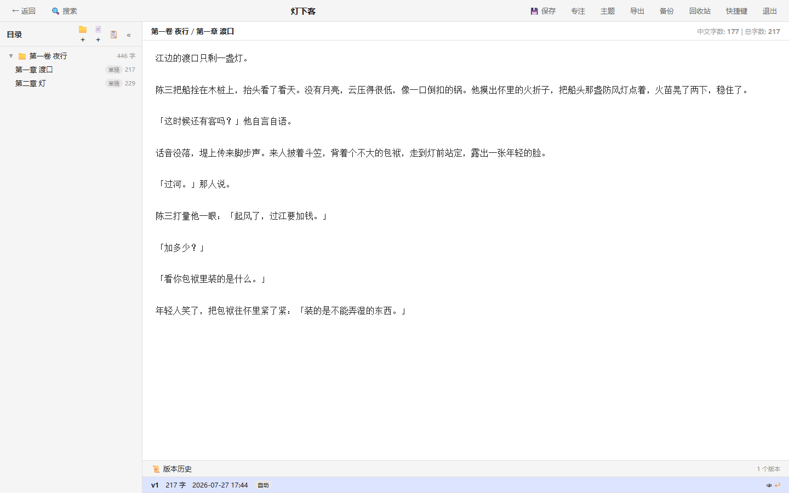
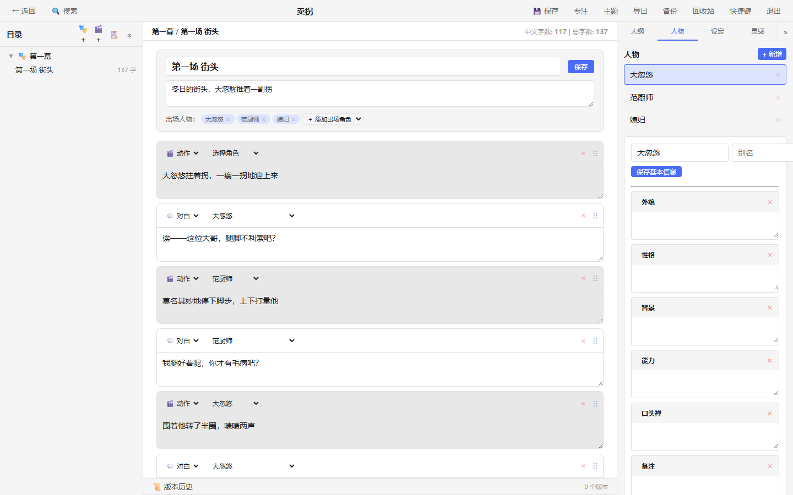
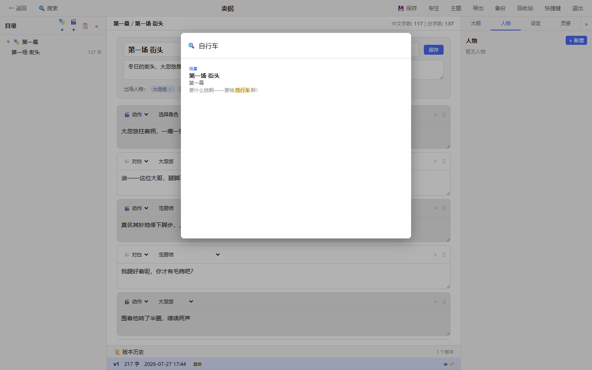
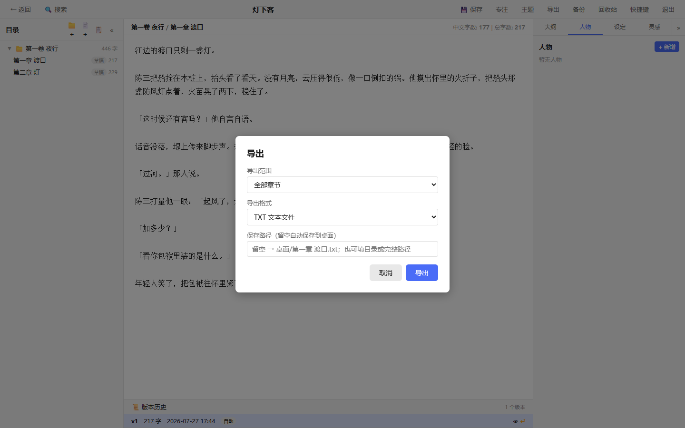
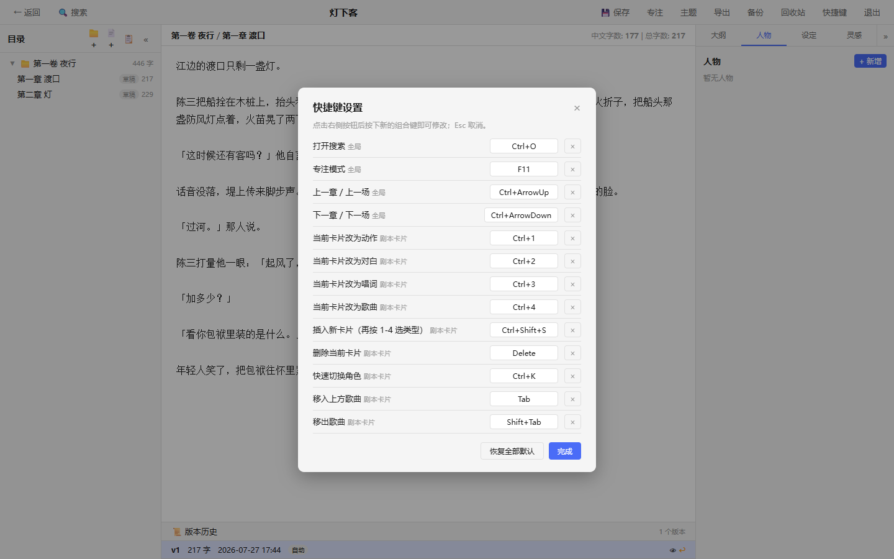

# 马良新手教程

「马良」是一款跑在你自己电脑上的本地写作工具，支持**小说、话剧剧本、音乐剧剧本**三种写作模式。它不需要联网、不用注册账号，所有内容都保存在你电脑上的一个数据库文件里，打开浏览器就能写。

这篇教程带你从零开始，把每个功能都过一遍。

## 一、安装与启动

### Windows

- **安装版**：双击 `马良 Setup.exe`，一路下一步装完，桌面和开始菜单里就有「马良」了，双击即用。
- **绿色版（免安装）**：解压 `马良-portable.zip`，双击里面的 `马良.exe` 即可。不写注册表，整个文件夹拷到 U 盘也能带走。

启动后会自动打开浏览器，地址是 `http://localhost:5200`。看到首页就说明成功了。

### macOS

打开 dmg，把「马良」拖进「应用程序」。首次打开如果提示"无法验证开发者"，到 **系统设置 → 隐私与安全性** 里点"仍要打开"放行一次即可。

## 二、首页：管理你的作品



首页列出你所有的作品卡片，每张卡片上能看到：

- **类型标签**：小说 / 话剧 / 音乐剧
- **统计**：小说显示「章数 · 字数」；剧本显示「幕 · 场 · 字数」；音乐剧还会多一个「歌曲数」
- **状态和最后更新时间**（写作中 / 已完成 / 暂停）

常用操作：

- **新建作品**：点上方「+ 新建作品」，填标题、选类型（小说 / 话剧剧本 / 音乐剧剧本）、写一句简介、填笔名，点「创建」。
- **打开作品**：点卡片空白处即可进入写作界面。
- **编辑作品信息**：点卡片上的「编辑」，可以改标题、副标题、笔名、简介和状态（改完记得点保存，不需要改就点取消）。
- **导入**：点「导入」选择一个 JSON 项目文件，会生成一个副本，不影响原文件（JSON 从哪来？见「导出」一节）。
- **删除**：点「删除」会把作品移入回收站，30 天内可以找回。



## 三、小说模式：卷、章与纯白编辑器

打开一部小说作品，界面分成三栏：左边是**目录树**，中间是**编辑器**，右边是可以收起的**资料面板**。



- **目录树是「卷 → 章」两级结构**。点卷名旁边的 ▶/▼ 可以展开或收起；侧栏顶部的 📁+ 新建卷、📄+ 新建章。右键卷或章可以重命名、删除。卷和章都可以**直接拖拽排序**，章还能拖到另一卷下面。
- **点章节名开始写作**。中间是一块纯白色的纯文本编辑器，没有花里胡哨的格式工具，就是让你专心码字。
- **点卷名可以写「卷首语」**，比如写一段本卷的题引。
- 右上角实时显示**中文字数和总字数**；目录树上每章后面也有字数，章节状态（草稿 / 初稿 / 修改中 / 定稿）会同步显示。
- 点编辑器工具栏的「**排版**」可以调整写作排版：衬线 / 黑体 / 等宽三种字体、字号、行距和栏宽（全宽 / 宽 / 适中 / 窄四档），改动即时预览，下次打开保持原样。
- 想更专心？点顶部「专注」（或按 F11）进入专注模式，Esc 退出。

## 四、话剧模式：幕、场与卡片编辑器

打开一部话剧作品，目录树变成「**幕 → 场**」两级（🎭+ 新建幕、🎬+ 新建场，幕和场可以直接拖拽排序，场还能拖到另一幕）。点开一个「场」，中间就是**卡片编辑器**：



- 顶部是**场景标题、场景描述和出场人物**，先在这里把这场戏的人物配好。
- 正文由一张张**卡片**组成，从上往下读就是剧本：
  - **动作**：舞台指示、动作描述；
  - **对白**：选好角色，写台词；
  - 还有**歌曲**和**唱词**（话剧里用得少，音乐剧里是主角，见下一节）。
- 每张卡片左上角可以切换类型和角色，右上角可以删除，按住卡片可以拖动排序。底部有一排「+ 动作 / + 对白 …」按钮用来插入新卡片。
- **齐白与叠白**：对白卡支持多角色同时说（齐白）；还有双列「叠白」容器表现两个人同时说话。
- 同角色的「动作 + 对白」连续卡片，导出时会自动合并成一段。

## 五、音乐剧模式：歌曲、唱词、重唱与游离歌曲

音乐剧在卡片编辑器的基础上多了**歌曲体系**。歌曲是一张容器卡片，里面嵌套若干**唱词**子卡片（每位角色一张）：



- **歌曲卡**：有歌名，双击或右键可以收起/展开整首歌。
- **唱词卡**：嵌在歌曲里，选好角色写唱词。歌曲底部有「+ 唱词」「+ 歌中对白」「+ 重唱」按钮。
- **重唱**：多人同时唱不同的词，重唱容器里每个声部一张唱词卡，导出时并排排列。
- **游离歌曲**：左边目录树下方的「🎵 游离歌曲」区，是你的歌曲素材库——写好了但还没决定放哪的歌。它不进正文，TXT/Word 导出不包含（JSON 导出会带上）。右键游离歌曲可以「挂到某场」，正文歌曲也能反向转回游离歌曲。

## 六、保存：自动保存 + 手动保存

- **自动保存**：编辑器里停下来几秒钟，内容就会自动存盘；切换章节时也会自动保存。
- **手动保存**：想立刻存，点顶部工具栏的「💾 保存」按钮。剧本模式下它会把当前场的所有卡片一次存好。
- **关窗防丢字**：直接关窗口或刷新页面时，程序会在页面关闭的最后一刻把还没来得及自动保存的内容兜底送出，最后几秒的字也不会丢。

## 七、版本历史：再也不怕改砸

编辑器底部有一条「📜 版本历史」，点一下就展开：



- 每次保存都会留下一个版本快照，标着版本号、字数、时间和来源（自动 / 手动 / 回滚）。
- **👁 查看**：弹出这个版本的完整内容，只读，放心看。
- **Δ 对比**：和上一个版本做 diff，新增的行标绿、删除的行标红，改了什么一目了然。
- **↩ 回滚**：回到这个版本。别担心，回滚前当前内容会自动备份成一个新版本，随时可以再回来。
- 卷首语也有独立的版本历史——编辑卷首语时底部同样会展开「版本历史」，可以对比和回滚。

## 八、资料面板：大纲、人物、设定、灵感

编辑器右侧是资料面板，四个标签页：



- **大纲**：树形大纲，支持主线 / 支线 / 伏笔分类，还能关联到具体章节。目录上方的 📋 按钮可以快速打开它。
- **人物**：给每个角色建档案，字段随便加（外貌、性格、背景、口头禅……），还有出场记录。
- **设定**：世界观设定，按地理、历史、魔法等分类管理。
- **灵感**：便签式的灵感收集，支持标签。

点右上角的 » 可以收起面板，收起后点边缘的 « 再展开；左目录树同理（« 收起、» 展开）。收起状态会被记住，下次打开保持原样。

## 九、全文搜索

按 **Ctrl+P**（或点顶部「🔍 搜索」），输入关键词即可全局搜索：



搜索范围覆盖：章节正文、剧本场景卡片、游离歌曲、大纲、人物、设定、灵感。结果会标出类型和上下文片段，关键词高亮，**点结果直接跳到对应位置**。Esc 关闭。

## 十、导出：TXT / Word / JSON

打开作品后点顶部「导出」：



- **TXT 文本**：可以导出全部章节，也可以只导出当前章节。
- **Word (.docx)**：可选字体（宋体/黑体/楷体/仿宋/微软雅黑）、字号和行距，排版规整。
- **JSON 项目文件**：整项目导出（含全部章节、版本历史、人物、设定等，不含回收站）。用来备份或搬家；在首页点「导入」读入 JSON，会**生成一个副本**，不会覆盖原作品。

保存路径留空就自动存到桌面，也可以自己填目录或完整路径。

## 十一、备份与回收站

- **备份**：点顶部「备份」，一键把整个数据库复制到用户目录；弹窗里能看到数据库文件的位置，恢复时无需手输路径——对话框会自动列出本应用创建过的全部备份文件供下拉选择（恢复会覆盖当前数据并需要重启，谨慎操作）。
- **回收站**：删除的作品、卷、章、幕、场都会先进回收站，30 天后自动清除。点顶部「回收站」可以找回或彻底删除；每条目会显示剩余保留天数，快到期（3 天内）会标红提醒。

## 十二、个性化：主题、快捷键、侧栏

- **主题**：点顶部「主题」在 亮色 → 暗色 → 护眼 三套之间循环切换，按钮上会实时显示当前主题名；暗色主题下所有面板（包括版本对比、搜索结果）都已适配，不会看不清。
- **快捷键**：点顶部「快捷键」打开设置弹窗，点右侧按钮再按下新组合键即可改绑；搜索、专注模式、章节切换、卡片类型切换都能改，也可以一键恢复默认。



- **侧栏与面板收起**：见「资料面板」一节，收起状态自动记忆。

## 十三、常见问题

**Q：启动后浏览器打不开 / 提示端口被占用？**
默认端口是 5200。如果被占用，用命令行换个端口启动，例如：

```bash
马良.exe --port 5392
```

然后浏览器访问 `http://localhost:5392`。加 `--no-browser` 可以不自动打开浏览器。

**Q：我的数据存在哪？**
都在一个 SQLite 数据库文件里：

- Windows：`%APPDATA%/novel-writer/data.db`
- macOS：`~/Library/Application Support/novel-writer/data.db`
- Linux：`~/.novel-writer/data.db`

点顶部「备份 → 查看数据库文件位置」也能看到。换电脑时拷走这个文件（或先导出一个 JSON）即可。

**Q：怎么退出程序？**
点顶部工具栏最右边的「退出」，确认后服务会安全关闭，页面提示"已安全退出马良"，关掉浏览器窗口就行。写作内容在退出前都已自动保存。

**Q：误删了东西怎么办？**
先去「回收站」找（30 天内都在）；如果是改坏了章节内容，去底部「版本历史」回滚；都不行再从备份恢复。

## 十四、意见反馈

使用中遇到 bug，或者有什么功能建议？欢迎扫码填写调查问卷告诉我们：


